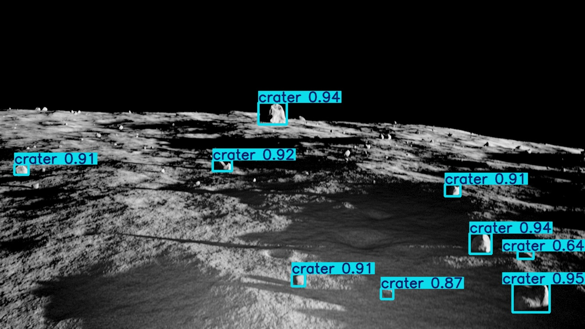
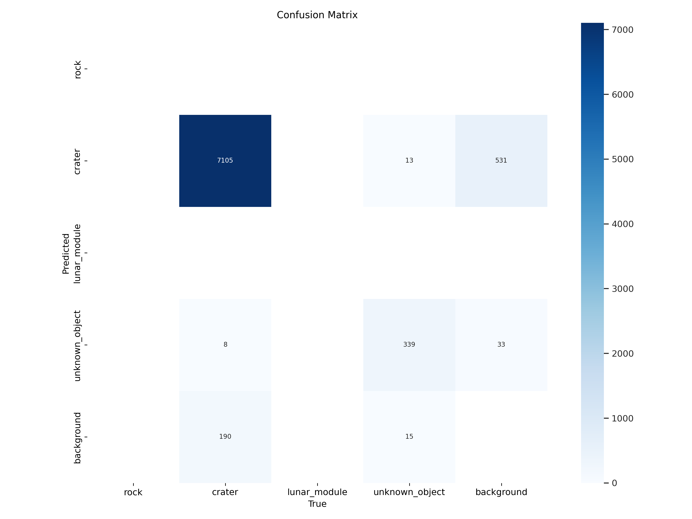
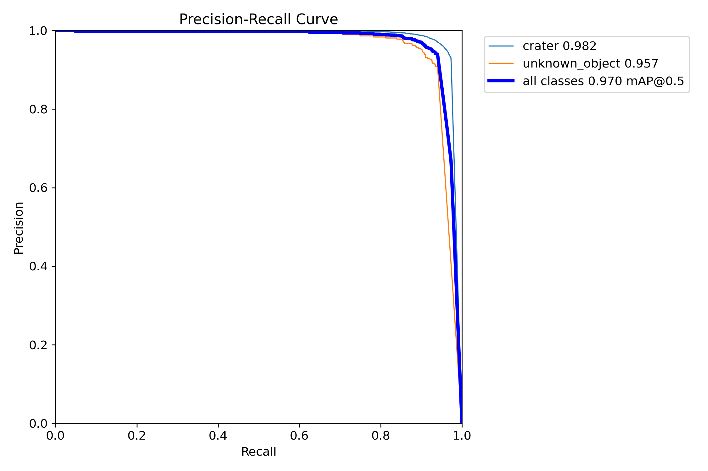
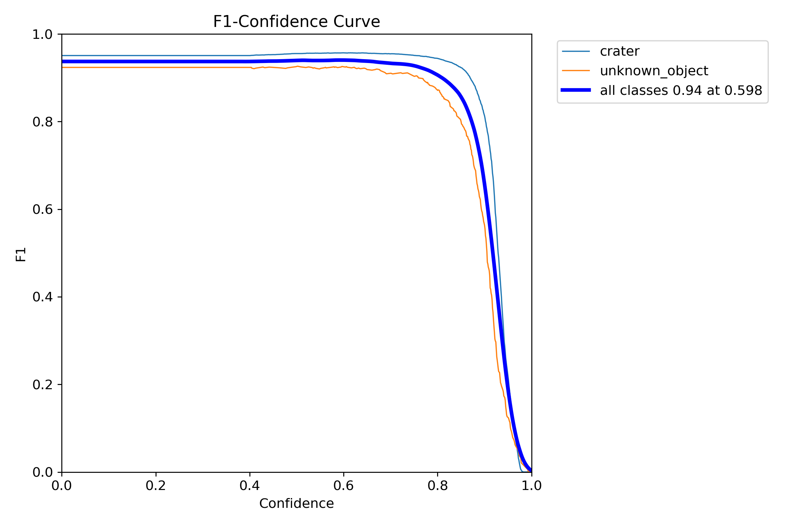
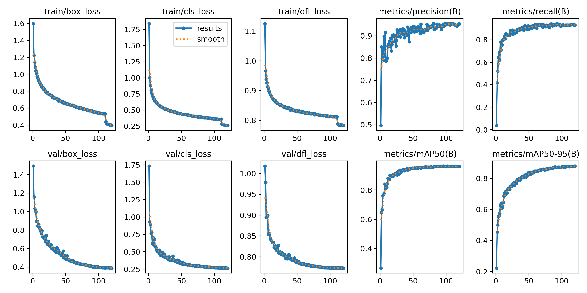

# **Lunar Surface Object Detection with YOLO**

## **Project Overview**
This project is for YOLO training of lunar simulation images for object detection purposes. The system aims to explore and map the surface of the moon through object detection and visual-inertial SLAM.

---

## **Features**
- **Object Detection** using Ultralytics YOLO, built on **PyTorch**.
- **Dataset Generation:** Prepares images and labels from grayscale and semantic input images.
- **Training Pipeline:** Supports optimized YOLO model training with image augmentations, batch processing, and mixed precision.
- **Pre-trained Model and Results**: Includes the best-trained model (best.pt) and sample prediction results.

---

## **Training Results**
The latest training results show **high precision (86-100%)** but **moderate recall (~63%)**. This indicates that the model is highly accurate when it makes predictions but may miss some objects in certain cases. Further optimization may improve recall while maintaining precision.

## **Example Prediction**

Here is an example prediction result from the trained YOLO model:



> The model successfully detects and classifies lunar surface objects.

---

### **Confusion Matrix**
Illustrates the model’s classification accuracy.



---

### **Precision-Recall Curve**
Shows the balance between precision and recall.



---

### **F1-Confidence Curve**
Visualizes how the F1 score changes across different confidence thresholds.



---

### **Summary**
A summary of loss values, accuracy, and overall model performance.



---

## **Training Optimizations**
- **Training Parameters:**
  - **Mixed Precision:** Enabled by default (`amp=True`).
  - **Image Size**: `640x640` (faster training, efficient detection).
  - **Batch Size:** 64 (optimized for speed and efficiency).
  - **Workers:** 16 (faster data loading).
  - **Optimizer:** AdamW (better adaptation and stability).
  - **Learning Rate:** 0.0008 with a final factor of 0.01.
  - **Momentum:** 0.937 for training stability.
  - **Weight Decay:** 0.0005 for regularization and preventing overfitting.
- **Augmentations:**
  - **Mosaic:** 1.0 for enhanced image variety.
  - **Mixup:** 0.3 to improve generalization.
  - **HSV_V:** 0.6 to enhance contrast and brightness.
- **Validation & Early Stopping:**
  - **Validation:** Enabled to track model progress.
  - **Save Period:** Every 10 epochs.
  - **Patience:** 20 epochs for early stopping if no improvement.
- **Object Detection Enhancements:**
  - **Confidence Threshold:** 0.3 for small object detection.
  - **IoU Threshold:** 0.6 for improved Non-Maximum Suppression (NMS).
  - **Auto Anchor:** Enabled for optimized anchor sizes.

---

## **Project Structure**

```
project-directory/
│
├── training_images/                 # Input images (grayscale and semantic)
│   ├── grayscale/                   # Grayscale images for training
│   └── semantic/                    # Semantic segmentation masks
│
├── output_labels/                   # Generated YOLO-compatible annotation files
│
├── dataset/                         # Final dataset structure
│   ├── images/                      # Training and validation images
│   │   ├── train/
│   │   └── val/
│   └── labels/                      # YOLO annotation files
│       ├── train/
│       └── val/
│
├── scripts/                         # Project scripts
│   ├── generate_yolo_annotations.py # Script to generate YOLO annotations
│   ├── split_dataset.py             # Script to split images into train/val sets
│   ├── train_yolo.py                # Script to train the YOLO model
│   └── predict_yolo.py              # Script to predict images (object detection)
│
└── README.md                        # Project documentation
```

---

## **Steps for Training**

1. **Create Annotations:**
    - Create an `output_labels` folder on your desktop.
    - Run the `generate_yolo_annotations.py` script to generate annotations from the images.
    - This script uses semantic images to create YOLO-compatible labels, which will appear in the `output_labels` folder.
    - Make sure your folder paths and code match.

2. **Split Dataset:**
    - Run the `split_dataset.py` script to divide the dataset into training and validation sets.
    
3. **Start YOLO Training:**
    - Run the `train_yolo.py` script to start training.
    - The training process might take significant time, depending on your computer's GPU.

4. **Run Inference:**
    - Once training is successful, run the `predict_yolo.py` script to perform object detection on test images.

    **GOOD LUCK!**

---

**Author:** Miray Dicle
